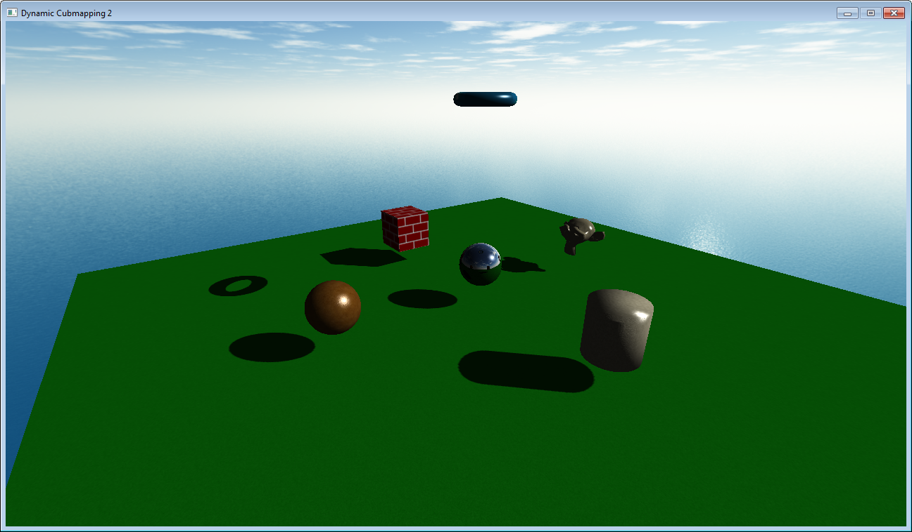

# Dynamic Cubemapping 2

This is a remake of my original dynamic cubemapping demo from 
2014... I've decided to remake from a using asking to view the source code from that project, however, the project didn't isn't very optimal is really needs an update to it. I've decided to remake it because I want to show the raw OpenGL code for learning purposes rather then the wrapping i did from the original. Plus I want to use OpenGL 4 instead of OpenGL 2 from that demo. If you want to view the original demo
from 2014. Here is a link to the youtube video.

https://www.youtube.com/watch?v=3wngkhdOfiI

Here is an example of what to expect from this demo...

